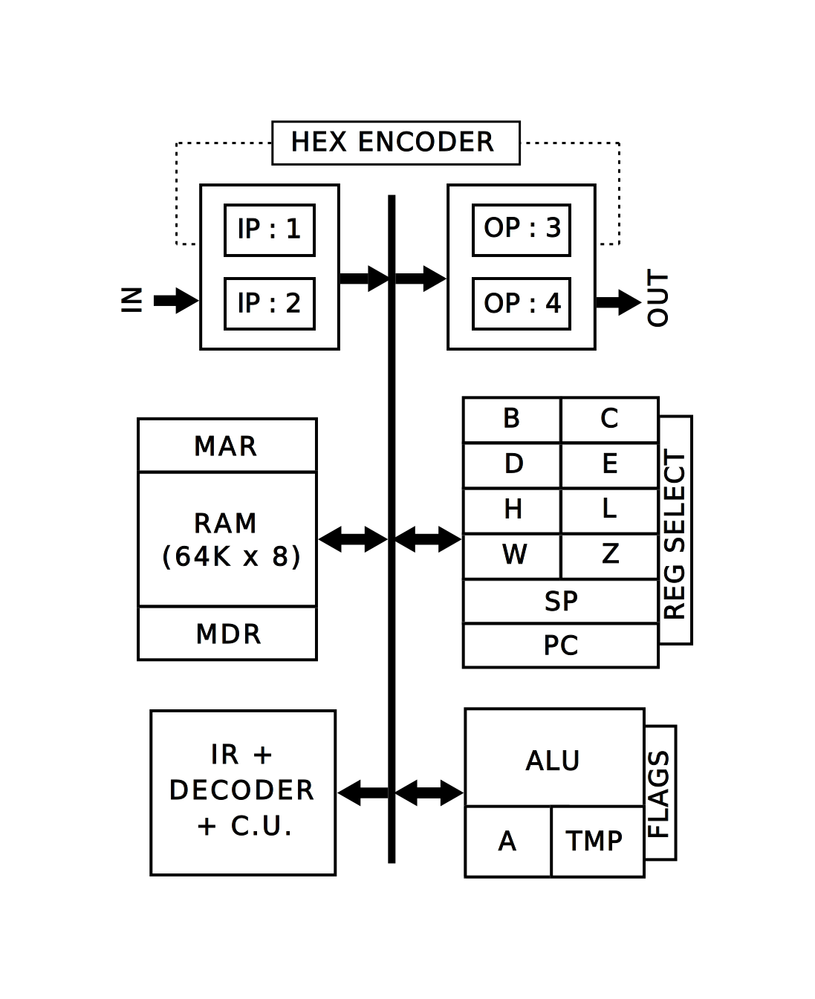

# CU8B-I: Custom Microprocessor Architecture


<div align="center">
  
</div>

## 🔧 Overview

**CU8B-I** is a custom-designed processor architecture inspired by SAP-1/2/3 and Intel 8085. This Verilog-based project simulates a complete microprocessor system, including memory, control unit, ALU, register bank, and I/O interfacing. Designed during the Summer Internship 2025 at NIT Raipur, it showcases instruction decoding, control word generation, and behavioral execution.

---

## 🧠 Key Features

- **Instruction Set:** 213 total instructions with support for conditional CALL, JUMP, RET.
- **Datapath Modules:**
  - General Purpose Register Bank (A, B, C, D, E, H, L, W, Z)
  - Special Registers: PC, SP, HL, WZ
  - ALU with 12 operations and Flag Register (S, Z, P, C)
- **Memory System:**
  - 64K x 8-bit RAM
  - Memory Address Register (MAR) and Memory Data Register (MDR)
- **Control Unit:**
  - 32-bit Control Word per instruction
  - Address ROM (10×256), Control ROM (32×1024)
  - Variable machine cycles using a preset counter
- **Input/Output System:**
  - Hexadecimal Encoder with handshake logic
  - Input Ports (IP1, IP2) and Output Ports (OP3, OP4)

---

## 📦 Project Structure

- `REGBANK.v` – Register file for 8-bit/16-bit operations
- `MEMAR.v` – Memory system and MAR/MDR interface
- `ALU.v` – Arithmetic Logic Unit with Temp and Accumulator registers
- `CU8B_1.v` – Top module with control logic and testbench
- `ADDROM.data`, `CONTROM.data`, `RAM.data` – ROM and RAM initialization files
- `TESTCU8B_1.v` – Sample testbench using a 10-second timer in assembly


---

## 📦 Setting Up in Vivado 2024.2

To use the CU8B-I project in Vivado:

### 1️⃣ Create a New Project

1. Open **Vivado 2024.2**
2. Select `Create New Project`
3. Name the project `CU8B_1`
4. Choose **RTL Project** → Enable `Do not specify sources at this time`
5. Click **Next** and select your target device or board

---

### 2️⃣ Add Design Sources

1. Right-click on **Design Sources** → `Add Sources`
2. Select `Add or Create Design Sources`
3. Add the following Verilog files:
   - `CU8B_1.v` (top-level module)
   - `DATAPATH.v`
   - `REGBANK.v`
   - `MEMAR.v`
   - `ALU.v`
   - `IR.v`, `IP1.v`, `IP2.v`, `OP3.v`, `OP4.v`
   - `HEXENCODER.v`, `ADDROM.v`, `CONTROM.v`, `PRESCNTR.v`, `CLKCTR.v`

---

### 3️⃣ Add Simulation Sources

1. Right-click on **Simulation Sources** → `Add Sources`
2. Select `Add or Create Simulation Sources`
3. Add:
   - `TESTCU8B_1.v` (provided testbench)

---

### 4️⃣ Add Memory Initialization Files

1. Place the following `.data` files in your project directory:
   - `RAM.data`
   - `ADDROM.data`
   - `CONTROM.data`
2. Edit the Verilog modules to ensure correct relative path if needed:
   ```verilog
   initial $readmemb("RAM.data", MEM);
   initial $readmemb("ADDROM.data", ADDROM);
   initial $readmemb("CONTROM.data", CONTROM);
   
---

## 🧪 Example Program: 10-Second Resettable Timer (Program in Assembly)

```assembly
MVI B,0x0b
MVI C,0x0c
MVI D,0x0d
IN2
ANI 0x01
JZ 0x0006
IN1
MVI A,0x80
OUT4
MVI A,0x00
OUT4
MOV A,L
CMP B
JZ 0x0021
CMP C
JZ 0x0006
POP H
CMP D
JZ 0x0032
LXI H,0x0000
OUT3
IN2
ANI 0x01
JZ 0x0025
IN1
MVI A,0x80
OUT4
MVI A,0x00
OUT4
OUT3
MOV A,H
ADD L
JZ 0x0006
DCX H
MOV A,L
SUI 0x0f
ANI 0x0f
JNZ 0x0045
MOV A,L
ANI 0xf9
MOV L,A
MOV A,L
SUI 0xf0
ANI 0xf0
JNZ 0x0051
MOV A,L
ANI 0x5f
MOV L,A
MOV A,H
SUI 0x0f
ANI 0x0f
JNZ 0x005d
MOV A,H
ANI 0xf9
MOV H,A
IN2
ANI 0x01
JZ 0x0032
PUSH H
JMP 0x000c
